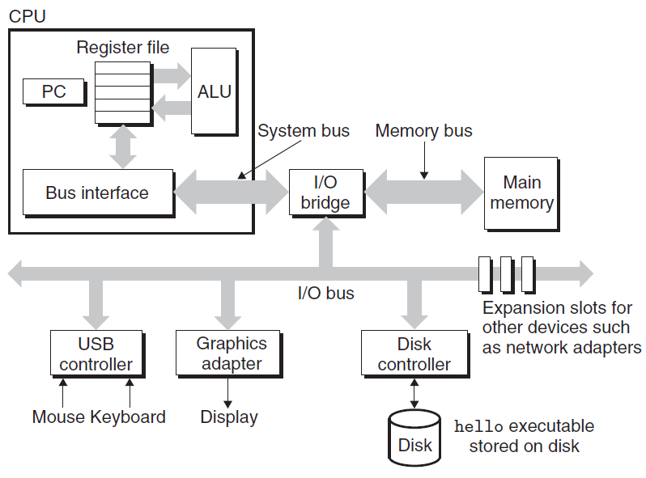
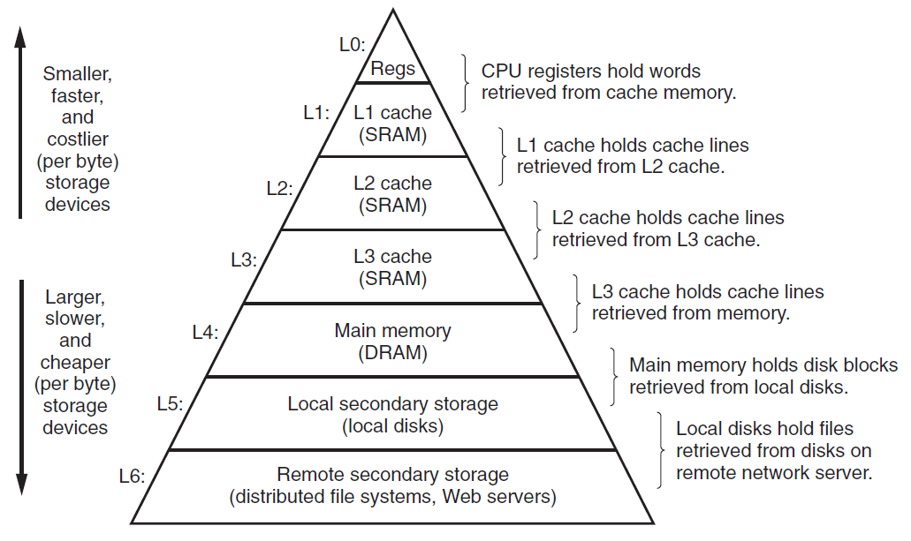
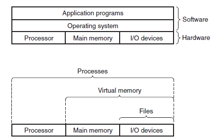
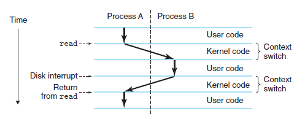
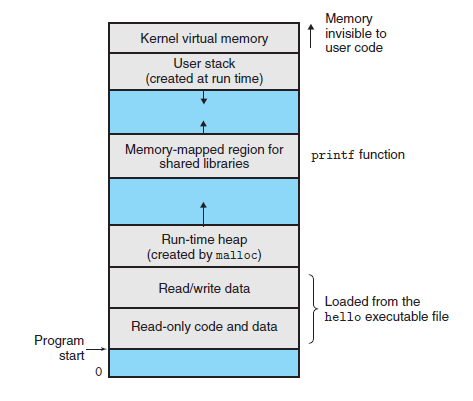

## 1 A Tour of Computer Systems

### 1.1 Information Is Bits + Context
All information is represented as a bunch of bits.
The only thing that distinguish different data objects is the context in which we view them

### 1.2 Programs Are Translated by Other Programs into Different Forms
Four Phases in translating programs(c language):
1. Preprocessing phase: Pre-process directives begin with '#' character.
2. Compilation phase: Translates c code to assembly language.
3. Assembly phase: Translates assembly language to machine language instructions
4. Linking phase: Merge object files.

### 1.3 It Pays to Understand How Compilation Systems Work

### 1.4 Processors Read and Interpret Instructions Stored in Memory
Hardware organization and components:

- Buses: carry bytes of information back and forth between the components
- I/O Devices: Input/output (I/O) devices are the system’s connection to the external world.
- Main Memory: A temporary storage device that holds both a program and
the data it manipulates while the processor is executing the program
- Processor: The engine that interprets (or executes) instructions stored in main memory

Four operations involved in running the program: Load, Store, Operate and Jump.

### 1.5 Caches Matter, 1.6 Storage Devices Form a Hierarchy
The system spends a lot of time moving information around.
Larger storage devices are slower than smaller storage devices. And faster devices are more expensive to build than their slower counterparts. Resulting in the *Processor-memory gap*.
To deal with the processor–memory gap, system designers include smaller, faster storage devices called cache memories (or simply caches) that serve as temporary staging areas for information that the processor is likely to need in the near future.

Hierarchied memory:

The main idea of a memory hierarchy is that storage at one level serves as a cache for storage at the next lower level.

On some networked systems with distributed file systems, the local disk serves as a cache for data stored on the disks of other systems.
### 1.7 The Operating System Manages the Hardware

We can think of the operating system as a layer of software interposed between the application program and the hardware.

The operating system has two primary purposes:
- To protect the hardware from misuse by runaway applications 
- To provide applications with simple and uniform mechanisms for manipulating complicated and often wildly different low-level hardware devices.

The operating system achieves both goals via fundamental abstractions:
- Processes
- Virtual memory
- Files

A **Process** is the operating system’s abstraction for a running program.
Concurrency: A single CPU can appear to execute multiple processes concurrently by having the processor switch among them. The operating system performs this interleaving with a mechanism known as *context switching*.

The transition from one process to another is managed by the operating system *kernel*.
Noted: kernel is not a separate process, it is a collection of code and data structures that the system uses to manage all processes.

A process can consisit of multiple execution units, called **Threads**, each running in the context of the process and sharing the same code and global data.

**Virtual Memory** is an abstraction that provides each process with the illusion that it has exclusive use of the main memory.

- Program code and data: Code begins at the same fixed address for all processes
- Heap: the heap expands and contracts dynamically at run time
- Shared libraries.
- Stack: also expands and contracts dynamically at run time
- Kernel virtual memory. Address reserved for the kernel.

### 1.8 Systems Communicate with Other Systems Using Networks
From the point of view of an individual system, the network can be viewed as just another I/O device.When the system copies a sequence of bytes from main memory to the network adapter, the data flow across the network to another machine, instead of, say, to a local disk drive. Similarly, the system can read data sent from other machines and copy these data to its main memory.

### 1.9 Important Themes
#### Amdahl’s Law
The main idea is that when we speed up one part of a system, the effect on the overall system performance depends on both how significant this part was and how much it sped up.

#### Concurrency and Parallelism
1. Thread-Level Concurrency
   Multiple control flows executing within a single process
2. Instruction-Level Concurrency
   Execute multiple instructions at one time
3. Single-Instruction, Multiple-Data(SIMD) Parallelism
   A single instruction to cause multiple operations to be performed in parallel.